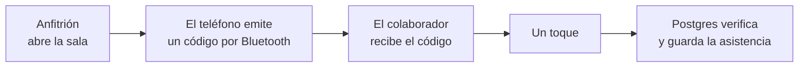
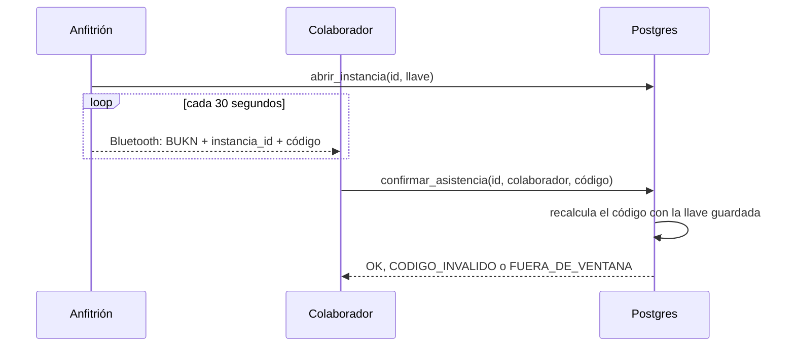
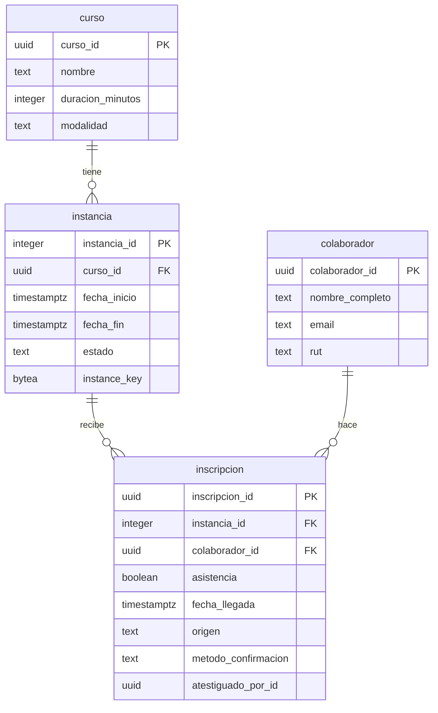
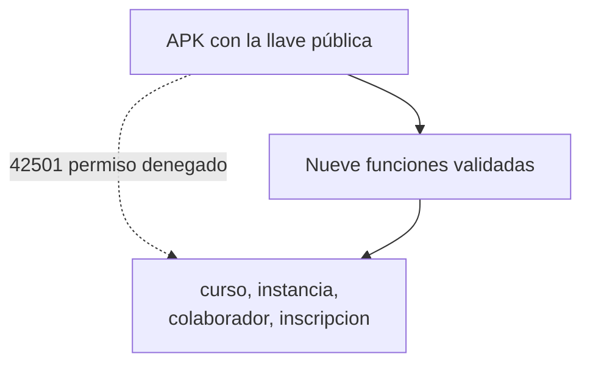
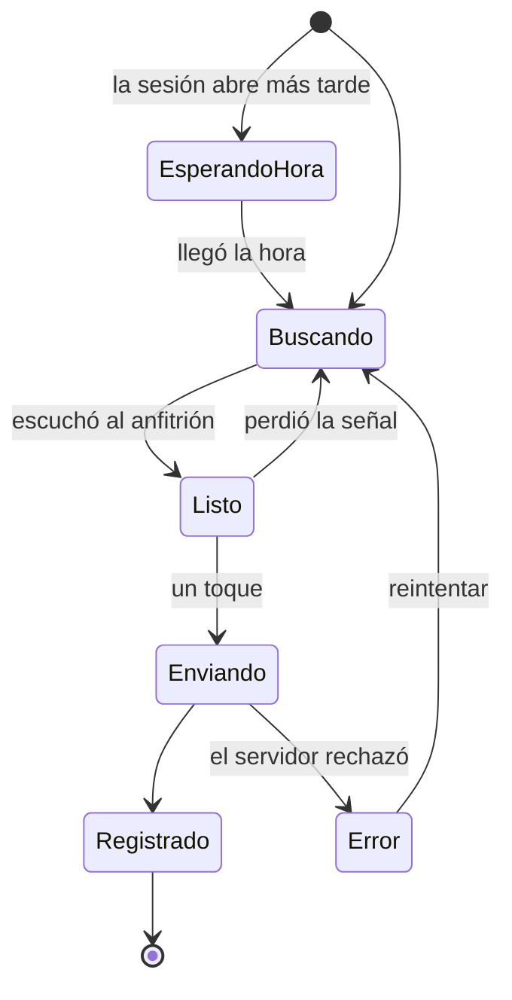

# BukIn

Asistencia a capacitaciones con un toque. El anfitrión abre la sala y su teléfono emite una
señal Bluetooth. Los colaboradores que están en la sala reciben esa señal y confirman su
asistencia con un toque. Nadie escribe listas después.

Android, Kotlin, Jetpack Compose. Base de datos en Supabase. Sin servidor propio.

## Descarga

El APK está en la sección **Releases** de este repositorio. Se instala directamente en un
teléfono Android 8.0 o superior.

## La idea en tres pasos



## Por qué el código cambia cada 30 segundos

Un código fijo se puede fotografiar y mandar por WhatsApp a alguien que está en su casa. Ese
es el fraude que este diseño elimina.

Cada instancia tiene una llave secreta de 16 bytes. El anfitrión la genera en su teléfono y
la sube una sola vez. Con esa llave se calcula un código nuevo cada 30 segundos:

```
código = HMAC-SHA256(llave, instancia_id + contador)[primeros 8 bytes]
contador = segundos_unix / 30
```

El colaborador escucha ese código y lo reenvía tal cual. Postgres vuelve a calcularlo con la
llave que tiene guardada y compara. Si coinciden, guarda la asistencia. Si el código tiene
más de una ventana de antigüedad, lo rechaza.

La llave viaja hacia arriba solamente. El anfitrión la sube, la base de datos la guarda,
ningún endpoint la devuelve. Así el teléfono del colaborador nunca puede generar códigos por
su cuenta.



## El esquema de la base de datos

Cuatro tablas.



**curso** es el contenido. Manejo de alimentos, primeros auxilios.

**instancia** es una fecha concreta de ese curso. Aquí vive `instance_key`, la llave con la
que se calculan los códigos.

`instancia_id` es un entero y tiene que seguir siéndolo. Va serializado como int32 dentro
del UUID de 128 bits que viaja por Bluetooth, y ahí caben cuatro bytes exactos.

**colaborador** es una persona.

**inscripcion** conecta a una persona con una fecha. La asistencia es una columna de esta
tabla, no una tabla aparte. Eso hace que `UNIQUE (colaborador_id, instancia_id)` sea lo que
garantiza que dos toques seguidos produzcan una sola fila.

Tres columnas cuentan la historia de cada asistencia:

| columna | valores | qué significa |
| --- | --- | --- |
| `origen` | `PRE_INSCRITO`, `WALK_IN` | si la persona se inscribió antes o llegó directo |
| `metodo_confirmacion` | `BLE`, `MANUAL`, `AUTO` | cómo quedó registrada |
| `atestiguado_por_id` | uuid del anfitrión | quién dio fe, cuando el registro fue a mano |

## Cómo está protegida

La llave pública de Supabase viaja dentro del APK. Cualquiera que descargue el archivo la
tiene. El diseño parte de esa base.

Todas las tablas tienen row level security activo y cero políticas. Los permisos de tabla
están revocados. Esa llave pública solo puede ejecutar nueve funciones, y cada una valida lo
que recibe antes de tocar una fila.



Consultar una tabla directamente con esa llave responde `42501 permission denied`. Está
comprobado sobre las cuatro tablas.

## Los estados de la pantalla

La pantalla del colaborador es una máquina de estados. El ticket y el pie de página se
quedan quietos. Solo cambia el centro.



Cada estado se ve distinto de un vistazo. Esa fue la queja más fuerte sobre el producto que
esto reemplaza: los botones se quedaban iguales y la gente terminaba sin saber si su
asistencia había quedado.

Cuando el servidor rechaza el código dos veces seguidas, la app deja de prometer que se va a
arreglar sola y dice qué pasa: la señal de la sala no coincide con lo que el servidor tiene.
Ahí ofrece el camino que sí funciona, que es pedirle al anfitrión el registro a mano.

## Estructura del proyecto

```
app/                    navegación y pantallas compartidas
domain/                 el códec del código rotativo, Kotlin puro, con pruebas
core/ble/               emisor, receptor, permisos, servicio en primer plano
core/data/              cliente de Supabase y repositorio
core/designsystem/      colores, tipografía, componentes, textos
features/onboarding/    las cuatro pantallas de bienvenida
features/checkin/       la pantalla del colaborador
features/host/          sala, lista de llegadas, registro a mano
supabase/migrations/    el esquema y las nueve funciones
```

`domain` no importa nada de Android. Por eso el códec se prueba en la JVM, sin teléfono.

## Compilar

```bash
./gradlew assembleDebug
./gradlew test
```

Las pruebas del códec incluyen un vector conocido. Con la llave
`000102030405060708090a0b0c0d0e0f`, la instancia 42 y el contador 58000000, el código es
`67e94bf8a08959ea`. Kotlin, Swift y SQL calculan ese mismo valor. Ese vector es la prueba de
que las tres implementaciones hablan el mismo idioma.

## Alcance de esta versión

El diseño completo está en [`docs/overview.md`](docs/overview.md): requisitos, API, modelo de
datos, arquitectura C4, alternativas evaluadas y riesgos.

Este repositorio implementa la porción que se puede construir y demostrar en un día, elegida
para probar lo único que no se puede asumir: que la presencia física en la sala se verifica
sola y que la asistencia queda guardada con un toque.

Lo que está funcionando:

| requisito | cómo queda resuelto aquí |
| --- | --- |
| R1 confirmar con una acción | un toque, sin que el anfitrión escriba nada |
| R2 asistencia sin inscripción previa | la rama INSERT del upsert marca `origen = WALK_IN` |
| R3 verificar presencia física | código BLE rotativo, validado en Postgres |
| R4 un solo registro | `ON CONFLICT (colaborador_id, instancia_id)`, sin pantalla de error |
| R6 concurrencia | cada confirmación toca una fila distinta, sin contador compartido |

Lo que quedó fuera a propósito, con la razón:

| pieza | por qué se dejó fuera |
| --- | --- |
| Autenticación JWT | el diseño la contempla y el límite de la RPC ya está preparado. Cambiar el `colaborador_id` que hoy manda el cliente por uno que salga del token es un argumento de diferencia por función |
| Outbox y worker | propaga hacia el sistema externo de cursos. En este demo no hay sistema externo al cual propagar, así que la tabla y el worker quedan en el documento de arquitectura |
| Relevo por anfitrión vía BLE | resuelve el caso sin conexión. Es la pieza de mayor riesgo técnico y menor valor para mostrar en vivo, así que la pantalla de sin conexión dice la verdad en vez de simular una cola que no existe |
| Marca de salida | la gente olvida marcarla. Resolverlo bien pide una decisión de producto que este demo no toma |

Cada una de esas cuatro sigue en pie en el documento de diseño. Construirlas encima de lo que
ya está es agregar piezas a algo que funciona.

## Dos límites que conviene decir en voz alta

**Reenvío en tiempo real.** Alguien puede retransmitir la señal por internet a un cómplice
que está lejos. Ningún esquema de proximidad por Bluetooth resuelve eso. La rotación cada 30
segundos elimina las fotos del código, los reenvíos por chat y la repetición de un código
viejo, que es el fraude que ocurre en la práctica. La lista de llegadas del anfitrión queda
como verificación humana.

**Identidad.** Bluetooth prueba que un teléfono estuvo en la sala. La autenticación prueba de
quién es. Por eso la primera pieza de la tabla de arriba es la que entra primero.

## Hardware con el que se probó

Un teléfono Samsung Galaxy A54 con Android 16, conectado por adb inalámbrico, y un Mac que
hace de segunda radio Bluetooth. El diseño permite que cualquier equipo con la llave transmita
el mismo código, así que el Mac funciona como un anfitrión más. Las herramientas están en
`tools/mac-ble/`.
